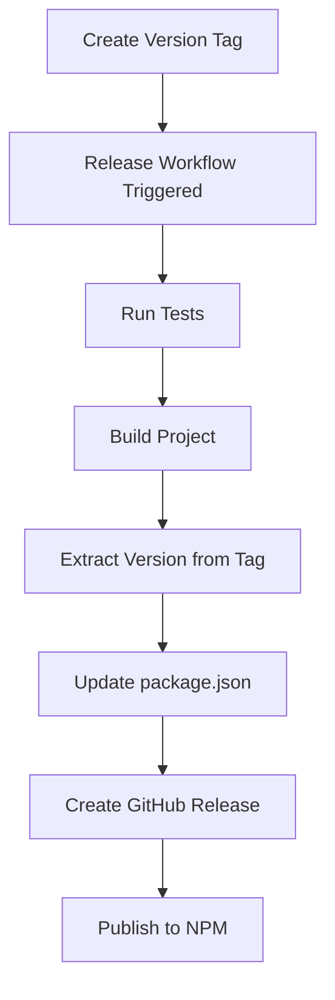

# GitHub Actions Workflows

This directory contains GitHub Actions workflows for automated CI/CD, releases, and dependency management.

## Workflows

### 1. CI Workflow (`.github/workflows/ci.yml`)

**Triggers:** Push to `main`/`develop` branches, Pull Requests

**Purpose:** Continuous Integration testing across multiple Node.js versions and operating systems

**Features:**

- **Multi-platform testing**: Ubuntu, Windows, macOS
- **Multi-version testing**: Node.js 18.x, 20.x, 22.x
- **Comprehensive testing**: Unit tests, integration tests (if credentials available)
- **Security checks**: npm audit signatures
- **Code quality**: Linting (if configured)
- **Coverage reporting**: Codecov integration

### 2. Release Workflow (`.github/workflows/release.yml`)

**Triggers:** Push of version tags (e.g., `v1.0.0`, `v1.2.3`)

**Purpose:** Automated release creation and publishing when version tags are pushed

**Features:**

- **Tag-based releases**: Triggered only when version tags are pushed
- **Automatic version extraction**: Extracts version from git tag
- **GitHub releases**: Automatic GitHub release creation with release notes
- **NPM publishing**: Automatic package publishing to npm registry
- **NPM provenance**: Supply chain security
- **Full testing**: Runs complete test suite before release

### 3. Manual Release Workflow (`.github/workflows/manual-release.yml`)

**Triggers:** Manual dispatch from GitHub Actions UI

**Purpose:** Manual release control with version specification and dry-run capability

**Features:**

- **Manual control**: Trigger releases manually when needed
- **Version specification**: Enter exact version number (e.g., 1.0.0)
- **Dry run mode**: Test release process without actually releasing
- **Version validation**: Ensures proper semantic versioning format
- **Tag conflict detection**: Prevents duplicate version tags
- **Full testing**: Runs complete test suite before release

## Setup Instructions

### 1. Repository Secrets

Configure the following secrets in your GitHub repository settings:

#### Required for Releases:

- `NPM_TOKEN`: NPM access token for publishing packages
  - Go to [npmjs.com](https://www.npmjs.com/) → Account → Access Tokens
  - Create a "Granular Access Token" with publish permissions
  - Add as repository secret

#### Optional for Integration Tests:

- `AUTOTASK_USERNAME`: Your Autotask username
- `AUTOTASK_INTEGRATION_CODE`: Your Autotask integration code
- `AUTOTASK_SECRET`: Your Autotask secret key
- `TEST_ACCOUNT_ID`: Test account ID for integration tests
- `TEST_CONTACT_ID`: Test contact ID for integration tests
- `TEST_PROJECT_ID`: Test project ID for integration tests

#### Optional for Coverage:

- `CODECOV_TOKEN`: Codecov token for coverage reporting

### 2. Branch Protection

Configure branch protection rules for `main` branch:

1. Go to Settings → Branches
2. Add rule for `main` branch
3. Enable:
   - Require status checks to pass before merging
   - Require branches to be up to date before merging
   - Select the CI workflow checks
   - Require pull request reviews before merging

### 3. Release Process

This project uses **tag-based releases** instead of semantic versioning automation:

#### Creating Releases

**Option 1: Using npm scripts (Recommended)**

```bash
# Patch release (1.0.0 → 1.0.1)
npm run release:patch

# Minor release (1.0.0 → 1.1.0)
npm run release:minor

# Major release (1.0.0 → 2.0.0)
npm run release:major
```

**Option 2: Manual tagging**

```bash
# Update version in package.json
npm version 1.2.3 --no-git-tag-version

# Commit the version change
git add package.json package-lock.json
git commit -m "chore: bump version to 1.2.3"

# Create and push tag
git tag -a v1.2.3 -m "Release v1.2.3"
git push origin main
git push origin v1.2.3
```

**Option 3: GitHub Actions Manual Release**

1. Go to Actions → Manual Release
2. Click "Run workflow"
3. Enter version number (e.g., 1.2.3)
4. Choose dry-run option if testing
5. Click "Run workflow"

### 4. Package.json Configuration

Ensure your `package.json` includes:

```json
{
  "repository": {
    "type": "git",
    "url": "https://github.com/your-username/your-repo.git"
  },
  "publishConfig": {
    "access": "public",
    "registry": "https://registry.npmjs.org/"
  }
}
```

## Dependabot Configuration

The `.github/dependabot.yml` file configures automatic dependency updates:

- **NPM dependencies**: Weekly updates on Mondays
- **GitHub Actions**: Weekly updates on Mondays
- **Auto-assignment**: Assigns PRs to specified reviewers
- **Labeling**: Adds appropriate labels for easy filtering

## Usage

### Automatic Releases

1. Make changes and commit to main branch
2. When ready to release, create a version tag:
   ```bash
   npm run release:patch  # or minor/major
   ```
3. Release workflow automatically:
   - Runs full test suite
   - Creates GitHub release
   - Publishes to npm

### Manual Releases

1. Go to Actions → Manual Release
2. Click "Run workflow"
3. Enter version number (e.g., 1.2.3)
4. Choose dry-run option if testing
5. Click "Run workflow"

### Integration Tests

Integration tests run automatically if Autotask credentials are configured as secrets. If credentials are missing, tests are automatically skipped.

## Troubleshooting

### Release Workflow Fails

1. **NPM Token Issues**: Verify `NPM_TOKEN` secret is valid and has publish permissions
2. **Permission Issues**: Ensure workflow has `contents: write` permission
3. **Tag Format**: Ensure tags follow `v*` format (e.g., v1.0.0, v1.2.3)
4. **Version Conflicts**: Check if version already exists on npm

### Manual Release Issues

1. **Version Format**: Use semantic versioning format (x.y.z)
2. **Duplicate Tags**: Check if tag already exists with `git tag -l`
3. **Permission Issues**: Ensure GitHub token has push permissions

### CI Workflow Issues

1. **Node Version**: Ensure your code is compatible with Node.js 18+
2. **Dependencies**: Run `npm audit` locally to check for vulnerabilities
3. **Tests**: Ensure all tests pass locally before pushing

## Security Considerations

- **Secrets**: Never commit secrets to the repository
- **Permissions**: Workflows use minimal required permissions
- **Provenance**: NPM packages include provenance for supply chain security
- **Audit**: Dependencies are automatically audited for vulnerabilities

## Release Workflow


