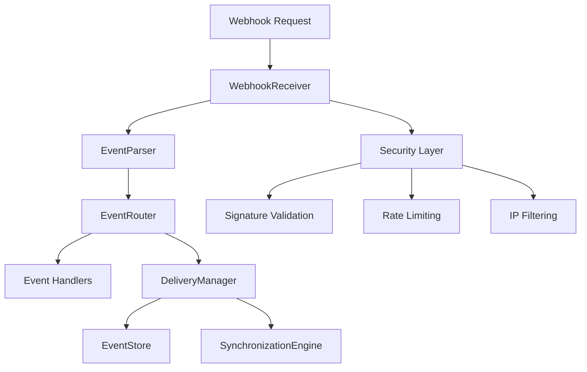

# Webhook and Event Handling System

The Autotask Node.js SDK includes a comprehensive webhook support and event handling system that enables real-time event-driven architectures with enterprise-grade webhook processing capabilities.

## Features

### 🔐 **Secure Webhook Receiver**

- Express.js integration with middleware support
- HMAC-SHA256 signature validation
- IP whitelisting and authentication
- Rate limiting and DDoS protection
- Input sanitization and validation

### ⚡ **Event Processing Engine**

- Typed event handlers for all Autotask entity events
- Event filtering and pattern matching
- Event transformation and enrichment
- Event replay and reprocessing capabilities

### 🔄 **Integration Patterns**

- Real-time bi-directional synchronization
- Event-driven workflow automation
- Multi-system event propagation
- Event sourcing and audit trails

### 🛡️ **Reliability Features**

- Event delivery guarantees (at-least-once, exactly-once)
- Dead letter queue for failed events
- Retry policies with exponential backoff
- Event monitoring and alerting
- Circuit breaker pattern for fault tolerance

### 🛠️ **Developer Experience**

- Webhook testing and simulation tools
- Event schema validation and documentation
- Debugging tools and event inspection
- Integration templates and examples

## Quick Start

### Basic Webhook Setup

```typescript
import { WebhookManager, WebhookHandler } from 'autotask-node';

// Configure the webhook system
const webhookManager = new WebhookManager({
  server: {
    port: 3000,
    path: '/autotask/webhook',
    secret: process.env.WEBHOOK_SECRET,
  },
  security: {
    validateSignature: true,
    signatureConfig: {
      algorithm: 'sha256',
      secret: process.env.WEBHOOK_SECRET,
      header: 'X-Autotask-Signature',
    },
  },
  delivery: {
    mode: 'at_least_once',
    retryPolicy: {
      maxAttempts: 3,
      initialDelayMs: 1000,
      backoffMultiplier: 2,
    },
  },
});

// Add event handler
const ticketHandler: WebhookHandler = {
  id: 'ticket-handler',
  name: 'Ticket Event Handler',
  filter: {
    entityType: ['Ticket'],
    action: ['create', 'update'],
  },
  handle: async event => {
    console.log(`Ticket ${event.action}: ${event.entityId}`);

    // Process the event
    await processTicketEvent(event);

    return { success: true };
  },
};

webhookManager.addHandler(ticketHandler);

// Start the webhook system
await webhookManager.start();
```

### Event-Driven Synchronization

```typescript
import { SynchronizationEngine } from 'autotask-node';

const syncEngine = new SynchronizationEngine();

// Configure synchronization
syncEngine.addSyncConfig({
  id: 'crm-sync',
  name: 'CRM Synchronization',
  enabled: true,
  autotaskToExternal: true,
  externalToAutotask: true,
  conflictResolution: 'timestamp',
  mappings: [
    {
      autotaskField: 'companyName',
      externalField: 'account_name',
      direction: 'bidirectional',
      required: true,
    },
    {
      autotaskField: 'phone',
      externalField: 'phone_number',
      direction: 'bidirectional',
      required: false,
    },
  ],
});

// Create webhook handler for sync
const syncHandler = syncEngine.createWebhookHandler();
webhookManager.addHandler(syncHandler);
```

## Architecture

### System Components



### Event Flow

1. **Receipt**: Webhook requests are received and validated
2. **Parsing**: Raw payloads are parsed into typed events
3. **Routing**: Events are matched to registered handlers
4. **Processing**: Handlers process events with reliability guarantees
5. **Storage**: Events are stored for replay and auditing
6. **Synchronization**: Events trigger bi-directional synchronization

## Configuration

### Webhook System Configuration

```typescript
interface WebhookSystemConfig {
  // Server configuration
  server: {
    port: number;
    host?: string;
    path?: string;
    secret: string;
    enableCors?: boolean;
    maxPayloadSize?: string;
  };

  // Security configuration
  security: {
    validateSignature: boolean;
    signatureConfig?: {
      algorithm: 'sha256' | 'sha1';
      secret: string;
      header: string;
      prefix?: string;
    };
    allowedIps?: string[];
    requireAuth?: boolean;
    rateLimiting?: {
      windowMs: number;
      max: number;
    };
  };

  // Delivery options
  delivery: {
    mode: 'at_least_once' | 'exactly_once';
    retryPolicy: {
      maxAttempts: number;
      initialDelayMs: number;
      maxDelayMs: number;
      backoffMultiplier: number;
    };
    deadLetterQueue?: boolean;
  };

  // Event store
  eventStore?: {
    type: 'memory' | 'redis' | 'mongodb';
    config: any;
  };
}
```

### Event Handler Configuration

```typescript
interface WebhookHandler {
  id: string;
  name: string;
  description?: string;
  priority?: number;
  enabled?: boolean;

  // Event filtering
  filter?: {
    entityType?: string | string[];
    action?: WebhookAction | WebhookAction[];
    conditions?: FilterCondition[];
  };

  // Handler function
  handle: (event: WebhookEvent) => Promise<WebhookHandlerResult>;
}
```

## Event Types

### Supported Autotask Events

- **Entity Events**: Create, Update, Delete for all entities
- **System Events**: User authentication, configuration changes
- **Batch Events**: Bulk operations and imports
- **Custom Events**: User-defined business events

### Entity Types

```typescript
enum AutotaskEntityType {
  TICKET = 'Ticket',
  PROJECT = 'Project',
  TASK = 'Task',
  COMPANY = 'Company',
  CONTACT = 'Contact',
  TIME_ENTRY = 'TimeEntry',
  CONTRACT = 'Contract',
  // ... and many more
}
```

## Testing and Simulation

### Webhook Simulator

```typescript
import { WebhookSimulator } from 'autotask-node';

const simulator = new WebhookSimulator({
  baseUrl: 'http://localhost:3000/autotask/webhook',
  secret: process.env.WEBHOOK_SECRET,
  signatureHeader: 'X-Autotask-Signature',
});

// Run predefined tests
const results = await simulator.runTests();

// Run continuous simulation
await simulator.runSimulation({
  eventTypes: ['entity.created', 'entity.updated'],
  entityTypes: ['Ticket', 'Project'],
  frequency: 2, // events per second
  duration: 60, // seconds
});

// Generate test report
const report = simulator.generateTestReport(results);
console.log(report);
```

### Creating Custom Tests

```typescript
simulator.addTest({
  id: 'custom-test',
  name: 'Custom Ticket Test',
  description: 'Test custom ticket scenario',
  payload: {
    eventType: 'create',
    entityType: 'Ticket',
    entityId: '12345',
    entity: {
      title: 'Test Ticket',
      priority: 'High',
      status: 'New',
    },
  },
  expectedResponse: { success: true },
  metadata: { category: 'custom' },
});

const result = await simulator.runTest('custom-test');
```

## Synchronization Patterns

### Bi-directional Sync

```typescript
const syncConfig = {
  id: 'salesforce-sync',
  name: 'Salesforce Integration',
  autotaskToExternal: true,
  externalToAutotask: true,
  conflictResolution: 'timestamp',
  mappings: [
    {
      autotaskField: 'companyName',
      externalField: 'Name',
      direction: 'bidirectional',
      required: true,
    },
  ],
};

syncEngine.addSyncConfig(syncConfig);
```

### Custom Transformation

```typescript
const mapping = {
  autotaskField: 'priority',
  externalField: 'priority_level',
  direction: 'bidirectional',
  transform: {
    toExternal: value => {
      const priorityMap = {
        Low: 1,
        Medium: 2,
        High: 3,
        Critical: 4,
      };
      return priorityMap[value] || 1;
    },
    fromExternal: value => {
      const priorityMap = {
        1: 'Low',
        2: 'Medium',
        3: 'High',
        4: 'Critical',
      };
      return priorityMap[value] || 'Low';
    },
  },
};
```

## Monitoring and Metrics

### System Health

```typescript
// Check system health
const health = await webhookManager.checkHealth();
console.log(health);
// {
//   status: 'healthy',
//   uptime: 3600000,
//   components: {
//     receiver: 'healthy',
//     router: 'healthy',
//     delivery: 'healthy'
//   }
// }
```

### Performance Metrics

```typescript
// Get system metrics
const metrics = webhookManager.getMetrics();
console.log(metrics);
// {
//   receiver: {
//     totalRequests: 1500,
//     successfulRequests: 1485,
//     averageResponseTime: 125
//   },
//   router: {
//     totalEvents: 1485,
//     processedEvents: 1485,
//     averageProcessingTime: 45
//   }
// }
```

## Error Handling

### Retry Policies

```typescript
const retryPolicy = {
  maxAttempts: 5,
  initialDelayMs: 1000,
  maxDelayMs: 60000,
  backoffMultiplier: 2,
  jitterMs: 100,
  retryableErrors: ['ECONNRESET', 'TIMEOUT', 'SERVICE_UNAVAILABLE'],
};
```

### Dead Letter Queue

Failed events are automatically sent to a dead letter queue for manual investigation:

```typescript
// Get dead letter queue jobs
const dlqJobs = await deliveryManager.getDeadLetterJobs();

// Retry a dead letter job
await deliveryManager.retryDeadLetterJob(jobId);
```

### Circuit Breaker

The system includes circuit breaker functionality to prevent cascade failures:

```typescript
// Circuit breaker automatically opens when failure threshold is reached
// and allows limited traffic through in half-open state for recovery
const circuitState = router.getCircuitBreakerState(handlerId);
console.log(circuitState);
// {
//   state: 'closed',
//   failureCount: 0,
//   lastFailure: undefined
// }
```

## Security Best Practices

### Signature Validation

Always validate webhook signatures:

```typescript
const security = {
  validateSignature: true,
  signatureConfig: {
    algorithm: 'sha256',
    secret: process.env.WEBHOOK_SECRET, // Store securely
    header: 'X-Autotask-Signature',
    prefix: 'sha256=',
  },
};
```

### IP Whitelisting

Restrict webhook sources:

```typescript
const security = {
  allowedIps: ['192.168.1.100', '10.0.0.0/8'],
};
```

### Rate Limiting

Prevent abuse:

```typescript
const rateLimiting = {
  windowMs: 15 * 60 * 1000, // 15 minutes
  max: 100, // requests per window
  message: 'Too many requests',
};
```

## Advanced Usage

### Custom Middleware

```typescript
const loggingMiddleware = {
  name: 'request-logger',
  before: async (req, res, next) => {
    console.log(`Webhook received: ${req.method} ${req.url}`);
    next();
  },
  after: async (req, res, result) => {
    console.log(`Webhook processed: ${result.success}`);
  },
};

webhookManager.addMiddleware(loggingMiddleware);
```

### Event Enrichment

```typescript
const parser = new EventParser({
  enrichEvents: true,
  // Custom enrichment function
  enrichEvent: async event => {
    // Add additional context
    if (event.entityType === 'Ticket') {
      const company = await getCompanyDetails(event.data.companyID);
      event.enrichedData = { company };
    }
    return event;
  },
});
```

### Custom Event Store

```typescript
class CustomEventStore implements EventStore {
  async save(event: WebhookEvent): Promise<void> {
    // Custom storage implementation
  }

  async get(eventId: string): Promise<WebhookEvent | null> {
    // Custom retrieval implementation
  }

  // ... other methods
}

const eventStore = new CustomEventStore();
```

## Performance Optimization

### Batch Processing

```typescript
const deliveryManager = new DeliveryManager({
  batchSize: 100,
  batchTimeout: 5000,
  concurrency: 10,
});
```

### Caching

```typescript
const parser = new EventParser({
  enableCaching: true,
  cacheConfig: {
    ttl: 300000, // 5 minutes
    maxSize: 1000,
  },
});
```

### Connection Pooling

```typescript
const eventStore = new EventStore({
  redis: {
    host: 'localhost',
    port: 6379,
    maxRetriesPerRequest: 3,
    lazyConnect: true,
    keepAlive: 30000,
  },
});
```

## Deployment

### Docker

```dockerfile
FROM node:18-alpine

WORKDIR /app
COPY package*.json ./
RUN npm ci --only=production

COPY . .
EXPOSE 3000

CMD ["node", "dist/webhook-server.js"]
```

### Environment Variables

```bash
# Webhook Configuration
WEBHOOK_PORT=3000
WEBHOOK_SECRET=your-secret-key
WEBHOOK_PATH=/autotask/webhook

# Redis Configuration (for event store)
REDIS_HOST=localhost
REDIS_PORT=6379
REDIS_PASSWORD=your-redis-password

# Security
ALLOWED_IPS=192.168.1.0/24,10.0.0.0/8
RATE_LIMIT_MAX=100
RATE_LIMIT_WINDOW=900000
```

### Health Checks

```yaml
# docker-compose.yml
version: '3.8'
services:
  webhook-service:
    build: .
    ports:
      - '3000:3000'
    environment:
      - WEBHOOK_SECRET=${WEBHOOK_SECRET}
      - REDIS_HOST=redis
    healthcheck:
      test: ['CMD', 'curl', '-f', 'http://localhost:3000/health']
      interval: 30s
      timeout: 10s
      retries: 3
    depends_on:
      - redis

  redis:
    image: redis:7-alpine
    ports:
      - '6379:6379'
```

## Troubleshooting

### Common Issues

1. **Signature Validation Fails**

   - Check secret configuration
   - Verify header name and format
   - Ensure raw body is preserved

2. **Events Not Processing**

   - Check handler filters
   - Verify event routing configuration
   - Review circuit breaker status

3. **High Memory Usage**
   - Enable event compression
   - Configure event TTL
   - Monitor queue sizes

### Debug Mode

```typescript
const webhookManager = new WebhookManager(config, logger);

// Enable debug logging
logger.level = 'debug';

// Add debug handlers
webhookManager.on('webhook:parsed', result => {
  console.log('Event parsed:', result);
});

webhookManager.on('webhook:routed', result => {
  console.log('Event routed:', result);
});
```

### Performance Monitoring

```typescript
// Monitor queue health
setInterval(async () => {
  const queueStats = await deliveryManager.getQueueStats();
  console.log('Queue stats:', queueStats);
}, 60000);

// Monitor memory usage
setInterval(() => {
  const memUsage = process.memoryUsage();
  console.log('Memory usage:', memUsage);
}, 30000);
```

## Contributing

We welcome contributions! Please see our [Contributing Guide](../../CONTRIBUTING.md) for details on:

- Setting up the development environment
- Running tests
- Submitting pull requests
- Code style guidelines

## License

This project is licensed under the MIT License - see the [LICENSE](../../LICENSE) file for details.
